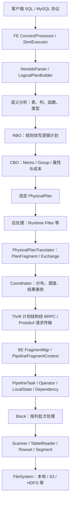
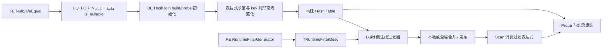

# Doris 二开架构与源码导航

核对日期：2026-09-11。目标场景：Doris 3.x，重点是 `<=>`、Nullable、Hash Join 和 Runtime Filter。本文是源码导航与二开边界说明，不是已复现的 crash 根因报告。

## 1. 先锁定代码版本

| 对象 | 本次核对的提交 | 证据范围 |
|---|---|---|
| 用户 fork `JavaCoder-Lambert/doris` 的 `master` | `9125fd692271ef6292a73000f4f95d53ecb24ee3` | 已本地检出并阅读源码；本文详细方法与行号基于此提交 |
| Apache 上游 `master` | `9125fd692271ef6292a73000f4f95d53ecb24ee3` | 本次抓取时与 fork 相同 |
| Apache 上游 `branch-3.0` | `4090f6c40d2238b7aff73185bcada48f96fbd6be` | 已核对 Git 树中的相关文件路径 |
| Apache 上游 `branch-3.1` | `a3e9f66a1106a4208e6855ffef9e0fb8b3c981ff` | 已核对 Git 树中的相关文件路径 |

**不能用当前 master 的行号、类拆分和修复状态直接代表线上 3.x。** `branch-3.0`、`branch-3.1` 是本次抓取的分支头，也不等于用户实际运行的发行包。正式复现应再锁定完整 Doris 版本、构建 Git hash、发行来源和编译模式。

用户后续提供精确版本 `doris-3.0.8-rc01-09b0cc49a6`，已匹配 tag `3.0.8-rc01` 与完整 SHA `09b0cc49a60ffdd444df3e40e5f3dc180299b561`。交付前 master 刷新为 `60042611fea1b18576470a7e3c49e14cd11243a4`，新增两项上游提交未改变本文关注的查询执行链；下文永久链接仍保留初始快照。

下面的源码链接固定到本次 master 提交，避免分支继续更新导致行号漂移；3.x 路径单独列在第 7 节。本地开发目录可按自己的 checkout 设置。

### 当前 4.1.4 二开入口

当前 release checkout 基于 `ad35a140c7fd0b842f18c23300bac581f7d04326`（官方 4.1.4），单字符串 NULL-safe Join 回补提交为 `523e9146c1ffd305edae46bb1bbbf3546d248163`。以下路径已在该树核对；**旧正文的 57 个源码链接仍指向 master `9125fd69…` 快照**，没有改成 4.1.4 的实现证明。

| 4.1.4 入口 | 本次二开关注点 |
|---|---|
| [hash_map_context.h](../../be/src/exec/common/hash_table/hash_map_context.h) 的 `MethodStringNoCache::init_serialized_keys_impl` | build/probe 传入 null map，NULL 行规范为默认 `StringRef`；保留普通字符串及空字符串语义 |
| [string_ref.h](../../be/src/core/string_ref.h) 的 `StringRef::eq` | 零长度提前返回，避免把默认空引用的空指针传入 `memcmp` |
| [hash_table_method_test.cpp](../../be/test/exec/hash_map/hash_table_method_test.cpp)、[string_value_test.cpp](../../be/test/runtime/string_value_test.cpp) | `testMethodStringNoCacheNullKeyNormalized`、`testMethodString64NoCacheNullKeyNormalized`、`StringRefTest.TestEmptyEquality` |
| [test_null_safe_eq_join_string_key.groovy](../../regression-test/suites/query_p0/join/test_null_safe_eq_join_string_key.groovy) | 从上游移植的官方 SQL suite，配套 [golden](../../regression-test/data/query_p0/join/test_null_safe_eq_join_string_key.out)；应保留原预期做修复前后对照 |

JDK 17 已验证可用于该版本回归框架；用命令级环境变量选择，不需改全局 Java。以下路径占位符需替换为实际 JDK 和隔离测试配置：

```bash
env JAVA_HOME=/path/to/jdk-17 JDK_17=/path/to/jdk-17 ./run-regression-test.sh --compile
env JAVA_HOME=/path/to/jdk-17 JDK_17=/path/to/jdk-17 ./run-regression-test.sh --run \
  --conf /path/to/local-regression-conf.groovy \
  -d query_p0/join -s test_null_safe_eq_join_string_key -parallel 1
# Linux BE 构建环境中的定向单测：
./run-be-ut.sh --run --filter='HashTableMethodTest.testMethodString*NullKeyNormalized:StringRefTest.TestEmptyEquality'
```

`run-regression-test.sh --compile` 构建回归框架/Java UDF，不生成修复后的 BE；`--run` 验证配置所连接的引擎。源码提交、框架成功、原版 ARM64 红测与目标 Linux x86_64 修复包成功是不同证据。实际包身份、构建/测试日志及升级条件见 [4.1.4 升级评估](4.1.4-upgrade-notes.md)，未填写的验收项仍待完成。

## 2. 总体结构：沿一条 SQL 看系统

Doris 的三个执行层应分别理解：MPP 决定跨 BE 如何分片和交换数据；Pipeline 决定一个 BE 内哪些任务可运行、如何让出线程；向量化决定算子如何处理一批列数据。3.x 官方说明 FE 负责请求、规划与元数据，BE 负责计算与存储，并支持从 3.0 开始选择存算分离部署。[官方 3.x 架构](https://doris.apache.org/docs/3.x/gettingStarted/what-is-apache-doris/)



这张图表示主查询路径；短路点查、缓存、导入、外部数据源有各自分支。存算分离也不另造一套 SQL/Hash Join 引擎，而是在共享查询执行框架下引入 Cloud 存储与元数据路径。

## 3. FE：语义、优化与分布式调度

Java 路径的共同前缀是 `fe/fe-core/src/main/java/org/apache/doris/`。

| 阅读顺序 | 精确入口 | 二开时关注什么 |
|---|---|---|
| 1. SQL 请求 | [`qe/ConnectProcessor.java:227`](https://github.com/JavaCoder-Lambert/doris/blob/9125fd692271ef6292a73000f4f95d53ecb24ee3/fe/fe-core/src/main/java/org/apache/doris/qe/ConnectProcessor.java#L227) `handleQuery`；[`qe/StmtExecutor.java:710`](https://github.com/JavaCoder-Lambert/doris/blob/9125fd692271ef6292a73000f4f95d53ecb24ee3/fe/fe-core/src/main/java/org/apache/doris/qe/StmtExecutor.java#L710) `execute` | 连接上下文、会话变量、语句执行、异常与结果返回；不要把优化规则塞到请求入口 |
| 2. 解析 | [`nereids/parser/NereidsParser.java:131`](https://github.com/JavaCoder-Lambert/doris/blob/9125fd692271ef6292a73000f4f95d53ecb24ee3/fe/fe-core/src/main/java/org/apache/doris/nereids/parser/NereidsParser.java#L131) `parseSQL`，`:273` `parseSingle` | SQL 语法如何变成逻辑计划；新增语法还要追 grammar 与 `LogicalPlanBuilder` |
| 3. 规划总流程 | [`nereids/NereidsPlanner.java:290`](https://github.com/JavaCoder-Lambert/doris/blob/9125fd692271ef6292a73000f4f95d53ecb24ee3/fe/fe-core/src/main/java/org/apache/doris/nereids/NereidsPlanner.java#L290) `planWithoutLock` | 按 `analyze → rewrite → optimize → chooseNthPlan → postProcess` 读；先判定异常计划在哪一阶段出现 |
| 4. Cascades 搜索 | [`nereids/jobs/executor/Optimizer.java:72`](https://github.com/JavaCoder-Lambert/doris/blob/9125fd692271ef6292a73000f4f95d53ecb24ee3/fe/fe-core/src/main/java/org/apache/doris/nereids/jobs/executor/Optimizer.java#L72) `execute`；[`memo/Memo.java:74`](https://github.com/JavaCoder-Lambert/doris/blob/9125fd692271ef6292a73000f4f95d53ecb24ee3/fe/fe-core/src/main/java/org/apache/doris/nereids/memo/Memo.java#L74) | 等价计划进入 Memo，优化任务探索候选；Memo 不是普通 SQL 结果缓存 |
| 5. Group 与成本 | [`nereids/memo/Group.java:59`](https://github.com/JavaCoder-Lambert/doris/blob/9125fd692271ef6292a73000f4f95d53ecb24ee3/fe/fe-core/src/main/java/org/apache/doris/nereids/memo/Group.java#L59) | 同一等价组保存逻辑/物理表达式；`lowestCostPlans` 按 `PhysicalProperties` 保存最优候选，不能只比较一个全局成本 |
| 6. 规则接口 | [`nereids/rules/Rule.java:32`](https://github.com/JavaCoder-Lambert/doris/blob/9125fd692271ef6292a73000f4f95d53ecb24ee3/fe/fe-core/src/main/java/org/apache/doris/nereids/rules/Rule.java#L32) `Pattern`、`RuleType`、`transform` | 按具体逻辑形态匹配；区分 rewrite、exploration、implementation，遵守阶段顺序 |
| 7. Hash Join 实现选择 | [`nereids/rules/implementation/LogicalJoinToHashJoin.java:28`](https://github.com/JavaCoder-Lambert/doris/blob/9125fd692271ef6292a73000f4f95d53ecb24ee3/fe/fe-core/src/main/java/org/apache/doris/nereids/rules/implementation/LogicalJoinToHashJoin.java#L28) | 将适用逻辑 Join 转成 `PhysicalHashJoin`，保留 join type、hash/other/mark conjuncts 和 mark slot |
| 8. 物理属性 | [`nereids/properties/RequestPropertyDeriver.java:245`](https://github.com/JavaCoder-Lambert/doris/blob/9125fd692271ef6292a73000f4f95d53ecb24ee3/fe/fe-core/src/main/java/org/apache/doris/nereids/properties/RequestPropertyDeriver.java#L245) `visitPhysicalHashJoin` | 输入分布要求决定可选择的 Broadcast/Shuffle 等路径；新增物理算子不能只新增类而漏掉属性推导 |
| 9. 计划下发表示 | [`nereids/glue/translator/PhysicalPlanTranslator.java:1559`](https://github.com/JavaCoder-Lambert/doris/blob/9125fd692271ef6292a73000f4f95d53ecb24ee3/fe/fe-core/src/main/java/org/apache/doris/nereids/glue/translator/PhysicalPlanTranslator.java#L1559) `visitPhysicalHashJoin`；[`NereidsPlanner.java:665`](https://github.com/JavaCoder-Lambert/doris/blob/9125fd692271ef6292a73000f4f95d53ecb24ee3/fe/fe-core/src/main/java/org/apache/doris/nereids/NereidsPlanner.java#L665) `splitFragments` | Nereids PhysicalPlan 仍要翻译为执行用 PlanNode/PlanFragment，表达式和 descriptor 在这里跨表示层 |
| 10. 分布与执行 | [`NereidsPlanner.java:764`](https://github.com/JavaCoder-Lambert/doris/blob/9125fd692271ef6292a73000f4f95d53ecb24ee3/fe/fe-core/src/main/java/org/apache/doris/nereids/NereidsPlanner.java#L764) `distribute`；[`qe/StmtExecutor.java:1550`](https://github.com/JavaCoder-Lambert/doris/blob/9125fd692271ef6292a73000f4f95d53ecb24ee3/fe/fe-core/src/main/java/org/apache/doris/qe/StmtExecutor.java#L1550)；[`qe/Coordinator.java:920`](https://github.com/JavaCoder-Lambert/doris/blob/9125fd692271ef6292a73000f4f95d53ecb24ee3/fe/fe-core/src/main/java/org/apache/doris/qe/Coordinator.java#L920) `sendPipelineCtx` | master 同时存在 `NereidsCoordinator` 与经 `EnvFactory` 创建 Coordinator 的分支；不能看到 Nereids 优化器就认定一定走某一种 Coordinator |

Nereids 的设计核心是规则化的逻辑变换与 Cascades 成本搜索，官方 3.x 文档也明确区分 RBO 与 CBO。[官方 3.x 优化器说明](https://doris.apache.org/zh-CN/docs/3.x/query-acceleration/optimization-technology-principle/query-optimizer/)

## 4. BE：任务、算子、列与存储

BE 的主线从 RPC 到 `Block`，再深入存储。不要直接从磁盘格式阅读整个工程；对待核查的历史 Join crash，先读执行与列类型。

| 层 | 精确入口 | 关键含义 |
|---|---|---|
| RPC 接收 | [`be/src/service/internal_service.cpp:558`](https://github.com/JavaCoder-Lambert/doris/blob/9125fd692271ef6292a73000f4f95d53ecb24ee3/be/src/service/internal_service.cpp#L558) `_exec_plan_fragment_impl` | 从传输请求解出执行片段，进入 FragmentMgr |
| 查询片段生命周期 | [`be/src/runtime/fragment_mgr.cpp:638`](https://github.com/JavaCoder-Lambert/doris/blob/9125fd692271ef6292a73000f4f95d53ecb24ee3/be/src/runtime/fragment_mgr.cpp#L638) `exec_plan_fragment` | 创建 `PipelineFragmentContext`，`prepare` 后 `submit` |
| 将计划变成 Pipeline | [`be/src/exec/pipeline/pipeline_fragment_context.cpp:702`](https://github.com/JavaCoder-Lambert/doris/blob/9125fd692271ef6292a73000f4f95d53ecb24ee3/be/src/exec/pipeline/pipeline_fragment_context.cpp#L702) `_build_pipelines`，`:1501` `_create_operator` | PlanNode 并不总是一对一变成算子；Join 的 build 和 probe 是不同流水线的部分 |
| 可运行的任务 | [`be/src/exec/pipeline/pipeline_task.cpp:455`](https://github.com/JavaCoder-Lambert/doris/blob/9125fd692271ef6292a73000f4f95d53ecb24ee3/be/src/exec/pipeline/pipeline_task.cpp#L455) `execute` | 检查依赖，获取 root 的 block，交给 sink；`:655` `get_block_after_projects`，`:728` `sink` |
| 状态与依赖 | [`be/src/exec/pipeline/pipeline_task.cpp:127`](https://github.com/JavaCoder-Lambert/doris/blob/9125fd692271ef6292a73000f4f95d53ecb24ee3/be/src/exec/pipeline/pipeline_task.cpp#L127) local state 初始化；[`dependency.cpp:69`](https://github.com/JavaCoder-Lambert/doris/blob/9125fd692271ef6292a73000f4f95d53ecb24ee3/be/src/exec/pipeline/dependency.cpp#L69) `set_ready`，`:91` `is_blocked_by` | Operator 描述计算；LocalState 保存任务实例状态；SharedState 连接 build/probe 等协作方；依赖将任务唤醒而不是占住线程等数据 |
| 向量化批次 | [`be/src/core/block/block.h:69`](https://github.com/JavaCoder-Lambert/doris/blob/9125fd692271ef6292a73000f4f95d53ecb24ee3/be/src/core/block/block.h#L69) `Block` | 一组 `ColumnWithTypeAndName`；`:182` 可核对行数，`:280` 有 scoped mutation。逻辑类型和运行时列对象是两个需要一致的层 |
| Nullable 列 | [`be/src/core/column/column_nullable.h:54`](https://github.com/JavaCoder-Lambert/doris/blob/9125fd692271ef6292a73000f4f95d53ecb24ee3/be/src/core/column/column_nullable.h#L54) `ColumnNullable` | 包装 nested column 与 UInt8 null map；`:91` 检查长度，`:104` `size`，`:105` `is_null_at`。空值标记与真实值列必须保持同步 |
| 扫描与存储读取 | [`be/src/exec/scan/olap_scanner.cpp:695`](https://github.com/JavaCoder-Lambert/doris/blob/9125fd692271ef6292a73000f4f95d53ecb24ee3/be/src/exec/scan/olap_scanner.cpp#L695) `_get_block_impl` → [`be/src/storage/iterator/block_reader.h:43`](https://github.com/JavaCoder-Lambert/doris/blob/9125fd692271ef6292a73000f4f95d53ecb24ee3/be/src/storage/iterator/block_reader.h#L43) `BlockReader` | Scanner 产出列批次；BlockReader 继承 TabletReader，负责带存储语义的数据读取 |
| Rowset 与 Segment | [`be/src/storage/rowset/beta_rowset_reader.cpp:78`](https://github.com/JavaCoder-Lambert/doris/blob/9125fd692271ef6292a73000f4f95d53ecb24ee3/be/src/storage/rowset/beta_rowset_reader.cpp#L78) `get_segment_iterators` → [`be/src/storage/segment/segment.cpp:413`](https://github.com/JavaCoder-Lambert/doris/blob/9125fd692271ef6292a73000f4f95d53ecb24ee3/be/src/storage/segment/segment.cpp#L413) `new_iterator` | 一个 Tablet 的版本数据由 Rowset 管理，Rowset 进一步组织 Segment；读取、合并与 delete bitmap 等语义在这条路径生效 |

3.x 官方 Pipeline 文档把 `PlanFragment → Pipeline → PipelineTask` 及 Operator/LocalState、build/probe 依赖分别解释；可先用它建立概念，再回到上述具体实现。[官方 3.x Pipeline](https://doris.apache.org/zh-CN/docs/3.x/query-acceleration/optimization-technology-principle/pipeline-execution-engine/)

## 5. 本次重点：`<=>`、Hash Join、Runtime Filter 如何衔接

`<=>` 的谓词结果本身是非 Nullable 布尔值，但它的左右输入可以是 Nullable。不要把“这个表达式的结果不能为 NULL”误读成“它参与比较的两边不是 Nullable”。master 的 [`NullSafeEqual.java:32`](https://github.com/JavaCoder-Lambert/doris/blob/9125fd692271ef6292a73000f4f95d53ecb24ee3/fe/fe-core/src/main/java/org/apache/doris/nereids/trees/expressions/NullSafeEqual.java#L32) 直接实现 `AlwaysNotNullable`，[`ExpressionTranslator.java:278`](https://github.com/JavaCoder-Lambert/doris/blob/9125fd692271ef6292a73000f4f95d53ecb24ee3/fe/fe-core/src/main/java/org/apache/doris/nereids/glue/translator/ExpressionTranslator.java#L278) 将它翻译成 `EQ_FOR_NULL`。



以下是阅读与断点顺序，**不代表已经证明哪一步有 bug**：

1. **FE 的语义仍正确吗？** 看 analyzed/rewrite/physical 三阶段的 Join conjunct、左右类型、join type 和输出 nullability。通过 `ExpressionTranslator` 核对 `<=>` 是否仍为 `EQ_FOR_NULL`；不能只看 SQL 字符串。
2. **BE 选择了什么 NULL key 表示？** [`hashjoin_build_sink.cpp:755`](https://github.com/JavaCoder-Lambert/doris/blob/9125fd692271ef6292a73000f4f95d53ecb24ee3/be/src/exec/operator/hashjoin_build_sink.cpp#L755) 从 opcode 和左右 nullable 元数据计算 `_is_null_safe_eq_join`；当前 master 对单 key 与多 key 的 `_serialize_null_into_key` 选择不同。这里体现“相同 SQL 语义可以有不同物理 key 表示”，不可把某个分支的假设搬到另一个分支。
3. **真实列对象是什么？** [`hashjoin_build_sink.cpp:516`](https://github.com/JavaCoder-Lambert/doris/blob/9125fd692271ef6292a73000f4f95d53ecb24ee3/be/src/exec/operator/hashjoin_build_sink.cpp#L516) `_do_evaluate` 与 `:553` `_extract_join_column`，probe 对应 [`hashjoin_probe_operator.cpp:425`](https://github.com/JavaCoder-Lambert/doris/blob/9125fd692271ef6292a73000f4f95d53ecb24ee3/be/src/exec/operator/hashjoin_probe_operator.cpp#L425) 和 `:338`。当前 master 明确要求先 materialize `Const(Nullable)` key；`is_nullable()` 不足以证明外层对象就是物理 `ColumnNullable`。这里需要同时看 `DataType`、`IColumn` 动态形态、row count、null map 长度和 key holder 的生命周期。
4. **Hash Table 的共享状态是否有效？** [`dependency.h:638`](https://github.com/JavaCoder-Lambert/doris/blob/9125fd692271ef6292a73000f4f95d53ecb24ee3/be/src/exec/pipeline/dependency.h#L638) `HashJoinSharedState` 保存 build block、arena 与 hash table variants。注释专门区分共享只读 hash table 和仍可能写入的序列化 key 状态；广播 Join 不等于所有相关对象都可无条件共享。
5. **RF 是谁生成、推向哪里？** [`RuntimeFilterGenerator.java:262`](https://github.com/JavaCoder-Lambert/doris/blob/9125fd692271ef6292a73000f4f95d53ecb24ee3/fe/fe-core/src/main/java/org/apache/doris/nereids/processor/post/RuntimeFilterGenerator.java#L262) 根据物理 Join、允许的 filter 类型与可下推目标生成描述；先排除不允许的 join type/mark join，再处理具体 conjunct。需要继续核对 `RuntimeFilterPushDownVisitor`，不能仅依据“这里有一个等值条件”认定一定生成或应用 RF。
6. **RF 的运行时数据和生命周期正确吗？** Build 的 [`hashjoin_build_sink.cpp:274`](https://github.com/JavaCoder-Lambert/doris/blob/9125fd692271ef6292a73000f4f95d53ecb24ee3/be/src/exec/operator/hashjoin_build_sink.cpp#L274) 调用 helper 的 `build/publish`。具体入口是 [`runtime_filter_producer_helper.cpp:134`](https://github.com/JavaCoder-Lambert/doris/blob/9125fd692271ef6292a73000f4f95d53ecb24ee3/be/src/exec/runtime_filter/runtime_filter_producer_helper.cpp#L134) 和 [`runtime_filter_producer.cpp:47`](https://github.com/JavaCoder-Lambert/doris/blob/9125fd692271ef6292a73000f4f95d53ecb24ee3/be/src/exec/runtime_filter/runtime_filter_producer.cpp#L47)，后者分本地/远端目标与 merge 路径。
7. **Scan 收到了什么？** [`runtime_filter_consumer.h:33`](https://github.com/JavaCoder-Lambert/doris/blob/9125fd692271ef6292a73000f4f95d53ecb24ee3/be/src/exec/runtime_filter/runtime_filter_consumer.h#L33) 定义消费方，`:58` `acquire_expr`；[`scan_operator.h:150`](https://github.com/JavaCoder-Lambert/doris/blob/9125fd692271ef6292a73000f4f95d53ecb24ee3/be/src/exec/operator/scan_operator.h#L150) 持有 `RuntimeFilterConsumerHelper`。RF 等待、超时、应用状态、过滤行数和 query cancel 都属于生命周期的一部分。

排查时可以把事实分成四组记录：**逻辑语义 → FE 下发元数据 → BE 实际列形态 → 并发生命周期**。仅切换 RF 后“不 crash”只表明路径相关，尚不能证明 RF 本体是根因；它还可能改变执行时序或数据批次。

## 6. 工程里真实有用的设计模式

不需要给所有类套 GoF 名称。以下模式能直接指导新增功能和定位故障。

| 模式 | 源码体现 | 为什么与二开有关 |
|---|---|---|
| 树结构与 Visitor | [`Plan.java:48`](https://github.com/JavaCoder-Lambert/doris/blob/9125fd692271ef6292a73000f4f95d53ecb24ee3/fe/fe-core/src/main/java/org/apache/doris/nereids/trees/plans/Plan.java#L48) 继承 `TreeNode<Plan>`，`:54` `accept(PlanVisitor)`；`PhysicalPlanTranslator`、`RequestPropertyDeriver` 都按具体计划类型处理 | 增加一个节点，要检查遍历、翻译、属性与统计等访问者。只改一个 `visit` 可能使其他阶段默默漏处理 |
| Pattern + Rule 变换系统 | `Rule` 的 `Pattern/RuleType/transform` 与 `LogicalJoinToHashJoin.build` | 匹配形态、前置条件、产出形态和阶段顺序是规则契约。Join 的空值、outer/anti/mark 语义不能被普通等值简化覆盖 |
| Cascades Memo 与成本搜索 | `Memo/Group/GroupExpression`、`OptimizeGroupJob`、`PhysicalProperties` | 保留等价候选，按要求属性比较成本。新增分布策略要接入属性和成本，不应仅硬编码一种结果 |
| Operator 与实例状态分离 | `PipelineTask` 为 operator 安装 LocalState，SharedState 连接协作算子 | 同一算子描述可以由多个任务执行；可变数据放错层，会导致并发串扰和销毁顺序问题 |
| 依赖驱动调度与生产者/消费者 | `Dependency::block/set_ready/is_blocked_by`，Join build/probe，RF producer/consumer | 数据还没好就让出执行线程；每条完成、失败、取消路径都要让依赖进入正确状态，避免悬挂或提前使用对象 |
| 包装列与 Copy-on-Write | `ColumnNullable` 包装值列/null map；[`core/cow.h:92`](https://github.com/JavaCoder-Lambert/doris/blob/9125fd692271ef6292a73000f4f95d53ecb24ee3/be/src/core/cow.h#L92) 和 `COWHelper`；Block scoped mutation | 类型包装形态与所有权必须同时处理。不能把共享 `ColumnPtr` 当作独占 mutable 列；也不能把 `Const(Nullable)` 当作裸 Nullable |
| 工厂与注册表 | [`simple_function_factory.h:133`](https://github.com/JavaCoder-Lambert/doris/blob/9125fd692271ef6292a73000f4f95d53ecb24ee3/be/src/exprs/function/simple_function_factory.h#L133) 保存 name → Creator，`:147` 注册，`:195` 查找函数 | 新函数除了计算实现，还要接好解析/类型推导、注册、常量和空值策略、序列化执行版本等路径 |
| 非虚拟接口封装与可替换实现 | `FileSystem::open_file` 调用 `open_file_impl`，各后端实现；`RemoteFileSystem` 统一添加缓存层 | 存储后端扩展应放在相应接口处，避免在算子内写 S3/HDFS 特例，也避免各后端重复实现缓存 |

## 7. master 与 3.x 的目录对照

下表的 3.x 路径在上述 `branch-3.0` 与 `branch-3.1` 提交树中均已核对存在；**仅验证路径不等于验证实现相同或修复已回移**。

| 模块 | 本次 master | 两个 3.x 分支的对应入口 |
|---|---|---|
| Nullable | `be/src/core/column/column_nullable.h` | `be/src/vec/columns/column_nullable.h` |
| Block | `be/src/core/block/block.h` | `be/src/vec/core/block.h` |
| Hash Join build | `be/src/exec/operator/hashjoin_build_sink.cpp` | `be/src/pipeline/exec/hashjoin_build_sink.cpp` |
| Hash Join probe | `be/src/exec/operator/hashjoin_probe_operator.cpp` | `be/src/pipeline/exec/hashjoin_probe_operator.cpp` |
| Pipeline 构建 | `be/src/exec/pipeline/pipeline_fragment_context.cpp` | `be/src/pipeline/pipeline_fragment_context.cpp` |
| Pipeline task | `be/src/exec/pipeline/pipeline_task.cpp` | `be/src/pipeline/pipeline_task.cpp` |
| Dependency | `be/src/exec/pipeline/dependency.h` | `be/src/pipeline/dependency.h` |
| RF 主入口 | `be/src/exec/runtime_filter/` 中 producer/consumer/helper/mgr | `be/src/exprs/runtime_filter.{h,cpp}`、`be/src/runtime/runtime_filter_mgr.{h,cpp}`；不能按 master 的拆分类名机械查找 |
| Scan operator | `be/src/exec/operator/scan_operator.h` | `be/src/pipeline/exec/scan_operator.h` |
| OLAP scanner | `be/src/exec/scan/olap_scanner.cpp` | `be/src/vec/exec/scan/new_olap_scanner.cpp` |
| Block reader | `be/src/storage/iterator/block_reader.h` | `be/src/vec/olap/block_reader.h` |
| Tablet / engine | `be/src/storage/tablet/tablet.h`、`be/src/storage/storage_engine.h` | `be/src/olap/tablet.h`、`be/src/olap/storage_engine.h` |
| Rowset / Segment | `be/src/storage/rowset/`、`be/src/storage/segment/segment.h` | `be/src/olap/rowset/`、`be/src/olap/rowset/segment_v2/segment.h` |
| 文件系统 | `be/src/io/fs/file_system.h` | 同路径 |
| FE RF 生成 | `.../nereids/processor/post/RuntimeFilterGenerator.java` | 同路径 |
| FE 协调器 | `.../qe/Coordinator.java`、`.../qe/NereidsCoordinator.java` | 两个类的文件均存在；选路与实现仍需以目标发行版本为准 |

建议先在实际 3.x 版本建立最小复现与测试，再沿同一语义链比较 master 的修复。跨版本移植时应迁移必要语义与测试，不能只因文件改名就整段替换。

## 8. Cloud、文件系统与协议边界

### Cloud 与本地存储

[`BaseStorageEngine/StorageEngine`](https://github.com/JavaCoder-Lambert/doris/blob/9125fd692271ef6292a73000f4f95d53ecb24ee3/be/src/storage/storage_engine.h#L93) 与 [`CloudStorageEngine`](https://github.com/JavaCoder-Lambert/doris/blob/9125fd692271ef6292a73000f4f95d53ecb24ee3/be/src/cloud/cloud_storage_engine.h#L56) 表达两种存储运行路径；[`CloudTablet`](https://github.com/JavaCoder-Lambert/doris/blob/9125fd692271ef6292a73000f4f95d53ecb24ee3/be/src/cloud/cloud_tablet.h#L78) 和本地 Tablet 都以 BaseTablet 为基础。云模式的 BE 通过 [`CloudMetaMgr`](https://github.com/JavaCoder-Lambert/doris/blob/9125fd692271ef6292a73000f4f95d53ecb24ee3/be/src/cloud/cloud_meta_mgr.h#L73) 与元数据服务通信；其 [`retry_rpc`](https://github.com/JavaCoder-Lambert/doris/blob/9125fd692271ef6292a73000f4f95d53ecb24ee3/be/src/cloud/cloud_meta_mgr.cpp#L560) 是统一重试入口。服务端入口是 [`cloud/src/meta-service/meta_service.h:85`](https://github.com/JavaCoder-Lambert/doris/blob/9125fd692271ef6292a73000f4f95d53ecb24ee3/cloud/src/meta-service/meta_service.h#L85) `MetaServiceImpl`。

因此，修改 Join NULL 语义通常优先在共享执行层定位；只有证据涉及 rowset、delete bitmap、版本同步或远端读取时，再深入 Cloud 分支。修改元数据 RPC 时要遵守现有错误分类、重试和幂等语义。

### 文件系统

[`FileSystem`](https://github.com/JavaCoder-Lambert/doris/blob/9125fd692271ef6292a73000f4f95d53ecb24ee3/be/src/io/fs/file_system.h#L85) 与 [`FileReader`](https://github.com/JavaCoder-Lambert/doris/blob/9125fd692271ef6292a73000f4f95d53ecb24ee3/be/src/io/fs/file_reader.h#L93) 把本地、S3、HDFS、Broker、HTTP 读取隔离在统一接口后面。公开 `open_file` 经 [`file_system.cpp:33`](https://github.com/JavaCoder-Lambert/doris/blob/9125fd692271ef6292a73000f4f95d53ecb24ee3/be/src/io/fs/file_system.cpp#L33) 的 `FILESYSTEM_M` 调用实现；远端缓存封装位于 [`remote_file_system.cpp:54`](https://github.com/JavaCoder-Lambert/doris/blob/9125fd692271ef6292a73000f4f95d53ecb24ee3/be/src/io/fs/remote_file_system.cpp#L54) `open_file_impl`。新增后端应保持这层职责划分。

### 协议不是只有一种

| 边界 | 实际表示/入口 | 修改约束 |
|---|---|---|
| 客户端 → FE | SQL / MySQL 协议 | SQL 语义兼容与会话变量行为 |
| FE → BE 的计划数据 | [`PlanNodes.thrift:1076`](https://github.com/JavaCoder-Lambert/doris/blob/9125fd692271ef6292a73000f4f95d53ecb24ee3/gensrc/thrift/PlanNodes.thrift#L1076) `TEqJoinCondition`，`:1118` `THashJoinNode`，`:1605` `TRuntimeFilterDesc`；[`Exprs.thrift:317`](https://github.com/JavaCoder-Lambert/doris/blob/9125fd692271ef6292a73000f4f95d53ecb24ee3/gensrc/thrift/Exprs.thrift#L317) `is_nullable` | 字段含义、optional 缺省行为、生成代码与 FE/BE 双侧读取必须一致 |
| 执行控制与 RF RPC | [`internal_service.proto:1232`](https://github.com/JavaCoder-Lambert/doris/blob/9125fd692271ef6292a73000f4f95d53ecb24ee3/gensrc/proto/internal_service.proto#L1232) `exec_plan_fragment`，`:1250` `merge_filter`，`:1253` `apply_filterv2` | 请求/响应、attachment、callback 与 query 生命周期；异步回调不能悬空，也不能过久持有整个查询 |
| BE → Cloud 元数据服务 | [`cloud.proto:2402`](https://github.com/JavaCoder-Lambert/doris/blob/9125fd692271ef6292a73000f4f95d53ecb24ee3/gensrc/proto/cloud.proto#L2402) `MetaService` | 幂等、超时、重试、事务冲突和返回状态 |
| 持久化元数据 | [`olap_file.proto:85`](https://github.com/JavaCoder-Lambert/doris/blob/9125fd692271ef6292a73000f4f95d53ecb24ee3/gensrc/proto/olap_file.proto#L85) `RowsetMetaPB`，`:718` `TabletMetaPB` | 旧数据兼容与升级/回退读取；不是只修改当前进程内对象 |

Block、数据类型或函数序列化的变化，还必须沿目标版本检查 `be_exec_version`。可选字段与执行版本都不是自动兼容保证，需要实际的旧/新分支处理。

## 9. 二开入口选择与验证范围

| 想改什么 | 优先动哪一层 | 最有价值的验证 |
|---|---|---|
| SQL 语法或类型/NULL 推导 | parser、expression、analysis、translator | FE 类型/计划测试 + SQL 语义回归 |
| 谓词下推或 Join 改写 | 具体 rewrite/exploration rule 与注册阶段 | 改写前后结果等价；outer/anti/mark、NULL、常量与空集 |
| Join 算法或 crash | Hash Join build/probe、key 表示、Column/Block 生命周期 | BE 单测/ASAN + 最小 SQL 回归；单/多 key、Nullable/非 Nullable、Const(Nullable) |
| Runtime Filter | FE 生成/下推 + BE producer/merge/consumer | 开关 RF 结果一致；不同 join/distribution/filter type；本地/远端、超时/取消、空 build |
| 列操作或函数 | Column/Block/COW 或函数工厂 | 常量/普通/Nullable 组合；行数一致；共享列被复用时不被意外修改 |
| 远端存储或 Cloud 元数据 | FileSystem/Reader 或 CloudMetaMgr/MetaService | 对应读写/重试/版本与生命周期测试，避免扩大到无关查询规则 |

本文的架构证据来自源码与 Git 树阅读、路径和行号核对；57 个固定提交源码链接均验证了本地文件存在且行号有效。本文不以架构推断替代事故复现，也不声称已编译验证 master。SQL 实测范围与已知失败单独记录在 [验证记录](null-safe-join-validation.md)。
