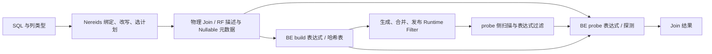

# NULL 安全等于、Nullable Join 与 Runtime Filter 排查

核对日期：2026-09-11。本文用于维护本 fork 和定位版本差异，不是生产事故根因确认书。

## 当前结论

- 调查起始时 fork/master 与上游均为 `9125fd692271ef6292a73000f4f95d53ecb24ee3`。交付前上游更新为 `60042611fea1b18576470a7e3c49e14cd11243a4`，本地二开分支已快进；新增两项上游提交没有修改本次关注的 Hash Join / Runtime Filter / Nullable 源码。
- 最新源码包含多项 NULL 安全 Join / Runtime Filter 历史修复。精确 3.0.8 的同组 100 项实测全通过，正式 4.1.4 为 80 通过、20 项单字符串 NULL 匹配错误；master 已有对应 #65975 修复但未构建实测。不能据此断言必须升级 4.1。
- 用户确认部署版本为 `doris-3.0.8-rc01-09b0cc49a6`，已解析到完整提交 `09b0cc49a60ffdd444df3e40e5f3dc180299b561` 和 tag `3.0.8-rc01`。截图提供了 SQL 尾部，但尚缺 `q_raw` 定义、表结构、执行计划及历史崩溃堆栈，因此尚未确认生产问题对应哪项修复。
- 本次尚未复现需要修改 master 的内核缺陷，现有候选已有对应处理，因此不凭症状追加空指针补丁。内核补丁应在匹配事故后，基于实际部署版本制作并验证。

### 用户截图的新证据

截图错误为 `1105 - errCode = 2, detailMessage = sql match regex sql block rule: block_null_safe_equal`，耗时 0.023 秒。这是已有 SQL 正则拦截规则产生的拒绝，不是该次查询发生 BE 崩溃的证据。

`fe/fe-core/src/main/java/org/apache/doris/blockrule/SqlBlockRuleMgr.java` 的 `matchSql()` 会在正则匹配后抛出这个 `AnalysisException`。需区分“历史执行曾崩溃，随后配置规则保护”与“本次被规则拦截”；截图不能证明规则是谁、何时、为何创建。

有 ADMIN 权限时可只读查看：

```sql
SHOW SQL_BLOCK_RULE FOR block_null_safe_equal;
```

不应以删掉规则、改注释或隐藏运算符的方式绕过已有保护。下面的改写从查询逻辑中移除了该自连接；是否用于生产仍需按实际数据验证。

截图可见的逻辑为：`q_key_profile` 按六字段 `GROUP BY` 并计算 `COUNT(*)`；`q_raw r` 与它逐字段 `<=>` 回连；最后只保留 `key_rows = 1`。这意味着**只保留六字段组合仅出现一次的原始行**，并不是“每组保留一条”。

可用 `COUNT(*) OVER (PARTITION BY 六字段)` 直接判断相同条件。分区计数也把 NULL 归入同一分组，不需要六个 NULL 安全 Join 条件。替换尾部见 [窗口计数 SQL](six-key-unique-rows.sql)。它保留 `r.*` 和末尾的 `__q_present`，用 `* EXCEPT` 去掉计数辅助列；辅助列名必须不与原数据列重名。

本次已核对 3.0 分支 parser 有 `SELECT * EXCEPT (...)`，没有 `QUALIFY`。不要采用未验证的 QUALIFY 写法。窗口方案消除了这段显式回连，但可能引入排序与分区开销，不能仅从计划结构承诺运行更快。等价性以 `q_raw` 是同一份确定性结果、键类型/比较语义一致为前提；完整 `q_raw` 尚待核对。

优先阅读 [精确 3.0.8 与最新版本对照](comparison-3.0.8.md) 和 [验证记录](null-safe-join-validation.md)。历史 PR 证据见 [候选修复](null-safe-join-candidates.md)，系统和源码阅读顺序见 [架构与二开指南](architecture-guide.md)。

## 1. 先统一运算符语义

`<=>` 是 **NULL 安全等于**，不是不等于；`NOT (a <=> b)` 才是它的否定。

| a | b | a = b | a <=> b | NOT (a <=> b) |
|---|---|---|---|---|
| 1 | 1 | TRUE | TRUE | FALSE |
| 1 | 2 | FALSE | FALSE | TRUE |
| NULL | 1 | UNKNOWN | FALSE | TRUE |
| 1 | NULL | UNKNOWN | FALSE | TRUE |
| NULL | NULL | UNKNOWN | TRUE | FALSE |

在 Nereids，`NullSafeEqual` 实现 `AlwaysNotNullable`，意味着**比较结果**不会为 NULL；这不意味着两个**输入列**都非 Nullable。

阅读入口（均以本文 master 快照为准）：

- `fe/fe-core/src/main/java/org/apache/doris/nereids/trees/expressions/NullSafeEqual.java`
- `fe/fe-core/src/main/java/org/apache/doris/nereids/glue/translator/ExpressionTranslator.java`：`visitNullSafeEqual` 转为 `EQ_FOR_NULL`。
- `be/src/exprs/function/comparison_equal_for_null.cpp`：标量表达式执行。
- `be/src/exec/operator/hashjoin_build_sink.cpp`、`hashjoin_probe_operator.cpp`：作为 Hash Join 等值键执行时走另一条路径。

只测 `SELECT NULL <=> NULL`，无法覆盖 Hash Join 和 Runtime Filter 的问题。

## 2. 一次查询中的关键契约



需要分别核对三种 Nullable：

1. **逻辑表达式属性**：FE 推导的 `nullable()` / Thrift 节点 `is_nullable`。
2. **数据类型**：BE 的 `DataTypeNullable` 包装。
3. **物理列表示**：`ColumnNullable` 的 nested column + null map；还可能存在 `ColumnConst(ColumnNullable(...))`。

外连接会给补齐行引入 NULL，CAST、函数与常量折叠也可能改变类型或列表示。即使表 DDL 写了 `NOT NULL`，进入算子的表达式也不一定保持相同属性。

Hash Join 的 build/probe 必须使用兼容的键编码和 NULL 表示。Runtime Filter 只是提前排除不可能匹配的行，不能丢掉本应通过 `<=>` 匹配的 NULL。单列 NULL 键、多列序列化键、普通 `=` 键不能随意混用同一套处理逻辑。

master 已有的具体边界：

- build/probe `init()` 对 `EQ_FOR_NULL` 且两侧都非 Nullable 的条件按普通等值处理，避免不必要的 Nullable 键路径。
- build/probe `_do_evaluate()` 物化常量列，然后 `_extract_join_column()` 才处理物理 `ColumnNullable`。
- `be/src/exec/common/hash_table/hash_map_context.h` 的字符串键处理会把 NULL 行的残留 payload 规范化为空 `StringRef`；真正空字符串仍进入普通哈希桶。这是结果正确性修复，不等于宕机修复。
- `RuntimeFilterTranslator.castTargetToSourceTypeIfNeeded()` 按 `CAST(probe target AS build source type)` 的实际方向计算 Nullable。

## 3. 版本快照与升级判断

| 本次获取的引用 | SHA | 范围 |
|---|---|---|
| fork/master、upstream/master | `9125fd692271ef6292a73000f4f95d53ecb24ee3` | 开发分支快照 |
| 交付前复核的 upstream/master / 二开分支基线 | `60042611fea1b18576470a7e3c49e14cd11243a4` | 新增提交未改变本次关注的源码 |
| 用户部署版本 / tag 3.0.8-rc01 | `09b0cc49a60ffdd444df3e40e5f3dc180299b561` | 用户提供构建串，已匹配精确源码 |
| upstream/branch-3.0 | `4090f6c40d2238b7aff73185bcada48f96fbd6be` | 分支头，不代表所有 3.0 发布包 |
| upstream/branch-3.1 | `a3e9f66a1106a4208e6855ffef9e0fb8b3c981ff` | 分支头，不代表所有 3.1 发布包 |
| upstream/branch-4.0 | `8a9961723ea4be00cdf923c60759607202c7e2e7` | 分支头 |
| upstream/branch-4.1 | `a060d01645981547374ac9ba195b9b8c729b3fb0` | 分支头 |

本次 clone/fetch 使用浅历史和按需对象。`git merge-base --is-ancestor` 在历史不完整时的失败不能用来证明“补丁未合入”。本报告用具体代码、上游 PR、backport 和发布记录交叉核对。

[官方下载页](https://doris.apache.org/download/) 当前维护分支为 4.1 / 4.0，分别标作 Latest / Stable。[版本说明](https://doris.apache.org/docs/4.x/features-architecture/versioning/) 建议生产选 Stable，Latest 用于新特性试用和测试，并提示稳定性风险。因此，准确表述是“4.1 已正式发布，属于 Latest 分支，生产选择仍需评估”，而不是把 4.1 一概称作未发布或测试版。

本次 GitHub `releases/latest` 返回 [Apache Doris 4.1.4 Release](https://github.com/apache/doris/releases/tag/4.1.4-rc04)，tag 为 `4.1.4-rc04`，`prerelease=false`，发布时间 2026-09-07。下载页不同语言和 Docker 镜像标签存在更新时差，不能只按一个页面的数字选测试版本，也不能因为 tag 含 `rc` 就推断未正式发布。

本文不把当前 master 当成可直接替换生产的发行包。3.x 到 4.x 还涉及大版本兼容性，不能只为一个候选 bug 跳过升级验证。若目标 3.x 小版本已含匹配补丁，应先重新检查事故归因和实际部署的 BE 二进制。

## 4. 定位需要的最小材料

先收集现有信息，不在生产主动重放已知会触发崩溃的 SQL。

```sql
SELECT VERSION(); -- 可能只返回 MySQL 兼容版本，不能单独判断 Doris 版本
SHOW FRONTENDS;
SHOW BACKENDS;
SHOW VARIABLES LIKE 'runtime_filter%';
SHOW VARIABLES LIKE 'enable_nereids_planner';
SHOW VARIABLES LIKE 'enable_pipeline%';
SHOW VARIABLES LIKE 'enable_shared_hash_table_for_broadcast_join';
```

保留 FE 和每台 BE 的真实版本字段，排除混部。另需脱敏后的：

- 原始 SQL 与查询 ID，注明运算符是 `<=>` 还是 `NOT (... <=> ...)`。
- 涉及表的 `SHOW CREATE TABLE`，含 NULL、CHAR/VARCHAR/STRING、DECIMAL 精度与表模型。
- 已有 `EXPLAIN VERBOSE` / Query Profile，尤其是 Join 类型、build/probe、RF 类型和目标表达式；没有现成计划时优先在测试环境生成。
- `be.out` / `be.INFO` 中事故前后日志、首个 FATAL/信号和完整调用栈。
- 是某台 BE 重启、全部 BE 不可用、FE 异常，还是单条查询失败；这些不能统一视为“宕机”。

Profile 和堆栈中出现 `ColumnNullable` 只是线索。`get_build_bf_cardinality`、`DecimalComparison`、`_extract_join_column`、`RuntimeFilterWrapper::set_state` 分别指向不同阶段。

## 5. 复现与对照矩阵

每次只改变一个维度，记录结果内容和执行计划。至少比较：

| 维度 | 对照 |
|---|---|
| 版本 | 实际故障版本 / 同支含修复版本 / 目标发行版本 / 自编译补丁 |
| 算子 | 标量 `<=>` / INNER JOIN / LEFT JOIN / 业务实际 Join |
| NULL | 两侧可空 / 单侧可空 / 两侧非空 / NULL 常量 / 全 NULL / 无 NULL |
| 表达式 | 原始列 / CAST / CONCAT / IF / 业务实际表达式 |
| 类型 | INT / STRING / 空字符串 / CHAR-VARCHAR / DECIMAL 精度差异 |
| RF | OFF / GLOBAL；在生成 RF 的例子中再分别测试 IN、BLOOM、MIN_MAX |
| 数据形状 | 重复 NULL、重复普通键、空 build、跨 block、多个 Join 键 |
| 分布 | 本机单 BE 验证语义后，再验证与故障环境相同的 shuffle/broadcast、多 BE |

`SET runtime_filter_mode='GLOBAL'` 不证明实际走了 RF：优化器可能不生成、裁剪掉或无法下推。必须保留 EXPLAIN 的 RF producer/target；要证明过滤器在运行时生效，还需 Profile 的生成、接收和过滤计数。

本地精确 3.0.8 与 4.1.4 上的样本结果不能证明 master 编译产物通过，也没有复现生产六字段历史崩溃。单 BE 测试不覆盖分布式 RF 合并和生命周期竞态。

## 6. SQL 临时规避及语义限制

针对候选 RF 路径，可以在隔离测试中比较同一连接的：

```sql
SET runtime_filter_mode = 'OFF';
-- 执行业务查询的最小复现并保存计划、结果、耗时。
```

测试后恢复此前会话值。关闭 RF 可能增加扫描、网络和 Join 开销；它是定位变量和候选规避方案，不是已验证的生产修复。

对确定性、同类型表达式，在 `JOIN ON` / `WHERE` 的筛选语境中，可以测试：

```sql
a = b OR (a IS NULL AND b IS NULL)
```

但它在仅一侧为 NULL 时返回 UNKNOWN，而 `<=>` 返回 FALSE，因此不能机械用于 `NOT` 或需要布尔值严格一致的投影。完整的二值语义写法是：

```sql
COALESCE(a = b, FALSE) OR (a IS NULL AND b IS NULL)

-- NULL 安全不等于
NOT (COALESCE(a = b, FALSE) OR (a IS NULL AND b IS NULL))
```

这类改写可能被优化器重新识别，或者改变 Join 策略，因此仍须检查最终计划。涉及隐式类型转换时先统一类型；涉及随机、时钟、UDF 等非确定表达式时先明确单次求值需求，不能任意重复表达式。

不要直接改成 `a = b`，否则 NULL-NULL 匹配会丢失；也不要无条件用 `COALESCE(a, '') = COALESCE(b, '')`，否则真实空字符串与 NULL 会混淆。NULL-NULL 匹配本来就会按两侧 NULL 行数的乘积产生结果，不能为了降低行数擅自去重。

## 7. 修复与 fork 维护步骤

1. 根据日志和准确版本选择一个能解释事故的候选；先用原版本重复复现并核对结果。
2. 基于实际部署 tag/SHA 建维护分支。master 保持适合追踪上游；不要为了修复一个 3.x 问题整体搬回新执行引擎。
3. 若上游已有匹配修复，优先回补最小提交及必要依赖，保留来源；若实现已重构，按旧分支真实调用链移植。
4. 新修复要覆盖 FE 元数据、BE 实际列、build/probe 两侧及 RF producer/consumer 契约，不以屏蔽断言或吞掉错误代替修复。
5. 在对应 Linux 工具链上用仓库 `build.sh` 构建 ASAN，并使用 `run-fe-ut.sh` / `run-be-ut.sh` / `run-regression-test.sh` 验证。原事故 SQL、结果完整性和邻近边界必须通过。
6. 对性能改动再比较 Profile 与代表性数据量；单次小样本耗时不能用来承诺生产性能。
7. 按明确文件白名单提交，核对 ignore 与 staged diff，推送到本 fork 的独立分支。生产部署另行进行。

## 8. 对业务同事的说明建议

> 已对比当前 3.0.8 与最新正式版 4.1.4：六字段查询的隔离样本均正常，尚未复现原宕机；4.1.4 另有单字符串表达式 NULL-safe Join 漏行问题，开发分支已有对应修复，因此不能承诺直接升 4.1 就能解决。当前截图是查询命中已有拦截规则。六字段唯一组合逻辑可用窗口计数去掉这段自连接，样本中已核对 NULL、重复键及输出列语义；实际替换仍应核对完整业务查询。原宕机归因需完整 SQL、执行计划和当时 BE 堆栈。是否迁移 MySQL，应结合数据量、并发和执行计划压测评估。

在尚未拿到事故证据前，应保留“怀疑/待确认”，而不是宣称已经定位；也没有本次实测证据可以断言某个 MySQL 实例一定扛不住。
